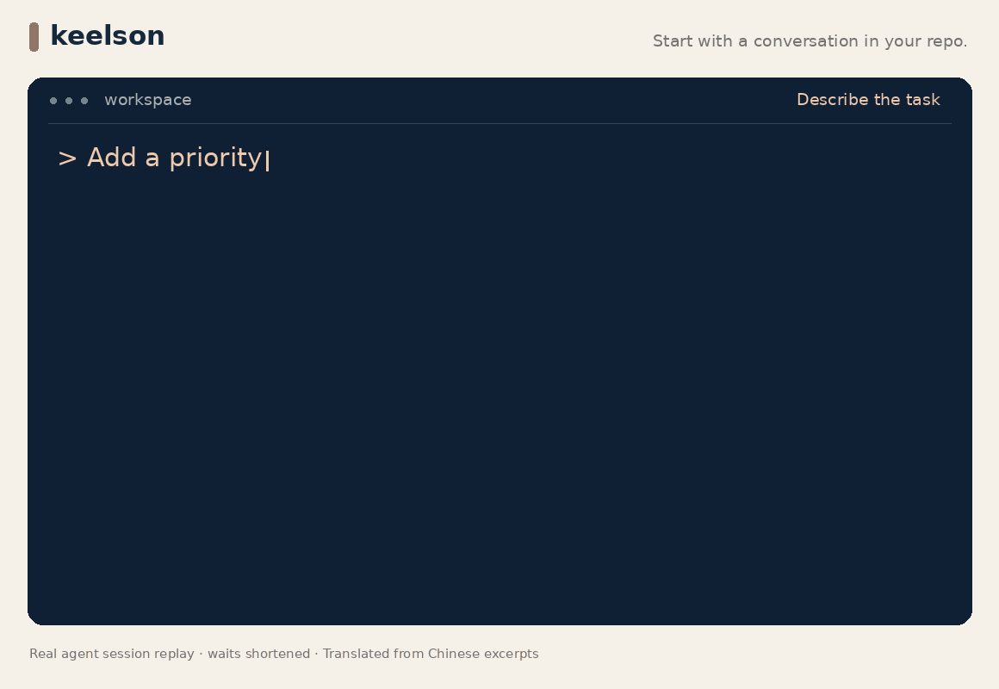

<p align="center"></p>

<p align="center"><strong>Give your coding agent a project memory and a clear path to done.</strong></p>
<p align="center">A local CLI + Agent Skill that keeps context, decisions, and verification with your code—from the first request to the next session.</p>

<p align="center">
<a href="README_CN.md">简体中文</a> ·
<a href="docs/README.md">Documentation</a> ·
<a href="#quick-start">Quick start</a> ·
<a href="docs/platforms.md">Agent support</a>
</p>

<p align="center">
<a href="https://github.com/Atingaii/keelson/actions/workflows/ci.yml"></a>
<a href="LICENSE"></a>
</p>

<p align="center"></p>
<p align="center"><sub>Real CLI output from a prepared example project. Fix, verify, and retain the result.</sub></p>

## What Keelson does

| Capability | Workflow |
| --- | --- |
| **Session continuity** | Project context, decisions, and unfinished work stay in the repository. |
| **Scoping and acceptance** | The agent reads the code, clarifies key decisions, and defines acceptance before implementation. |
| **Frontend design** | 22 [design actions](docs/frontend.md) cover visual craft, interaction, adaptation, and browser verification. Explore them with `keelson design`. |
| **Verification and archiving** | Check records follow the code they tested. Changed inputs require fresh verification before normal completion. |

## Quick start

Requires **Node.js 20+** and a coding agent. Install from source:

```bash
git clone https://github.com/Atingaii/keelson.git
cd keelson
npm ci
npm link

cd /path/to/your/project
keelson init --codex
```

`npm link` uses this checkout; keep it in place. [Setup and other agents →](docs/getting-started.md)

## Use it through conversation

> Improve the settings page. Keep our brand, preserve input when saving fails, and check the mobile flow.

1. **Describe the outcome.** The agent reads the project and clarifies the decisions that matter.
2. **Let it work.** It implements, reviews, and checks the result against the acceptance criteria.
3. **Keep the result.** It runs the configured checks with `keelson check --trust --record` and archives the change when the gates pass.

Review configured check commands before their first execution. Use `keelson status` whenever you want to see progress. Project notes grow as needed; initialization stays small.

[Full walkthrough](docs/getting-started.md) · [Verification and trust](docs/verification.md) · [CLI reference](docs/cli.md) · [Contributing](CONTRIBUTING.md) · [MIT](LICENSE)
