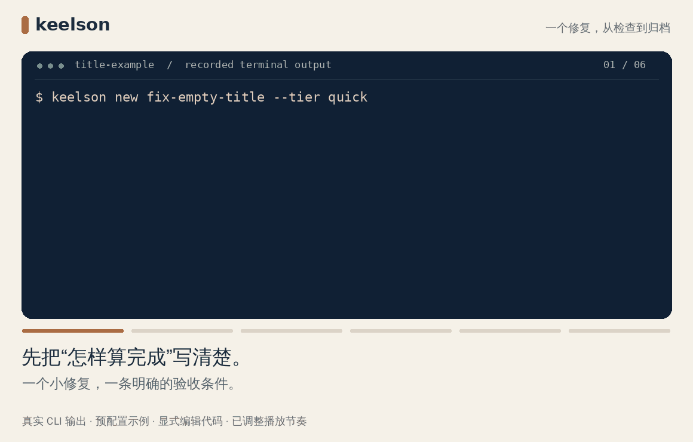

<p align="center"></p>

<p align="center"><strong>让编码 Agent 记住项目，把每次修改推进到验收。</strong></p>
<p align="center">本地 CLI + Agent Skill，将项目背景、决策和验证结果留在代码旁，让一次对话的成果成为下一次开发的起点。</p>

<p align="center">
<a href="README.md">English</a> ·
<a href="docs/zh/README.md">完整文档</a> ·
<a href="#快速开始">快速开始</a> ·
<a href="docs/platforms.md">Agent 支持</a>
</p>

<p align="center">
<a href="https://github.com/Atingaii/keelson/actions/workflows/ci.yml"></a>
<a href="LICENSE"></a>
</p>

<p align="center"></p>
<p align="center"><sub>来自预配置示例项目的真实 CLI 输出：修复问题，完成验证，保留结果。</sub></p>

## Keelson 能做什么

| 能力 | 工作方式 |
| --- | --- |
| **跨会话接续** | 项目背景、已有决策和未完成的工作留在仓库里。 |
| **澄清与验收** | Agent 先读代码，明确关键决策，并在实现前写下验收标准。 |
| **前端设计** | 22 个[设计动作](docs/zh/frontend.md)覆盖视觉、交互、适配和浏览器验证，运行 `keelson design` 即可查看。 |
| **验证与归档** | 检查记录绑定实际代码；输入变化后，正常完成流程要求重新验证。 |

## 快速开始

需要 **Node.js 20+** 和编码 Agent。从源码安装：

```bash
git clone https://github.com/Atingaii/keelson.git
cd keelson
npm ci
npm link

cd /path/to/your/project
keelson init --codex --lang zh
```

`npm link` 使用当前源码目录，请保留该目录。[完整安装与其他 Agent →](docs/zh/getting-started.md)

## 像平常一样对话

> 改善设置页，保留品牌风格。保存失败时保留输入，并检查手机端操作流程。

1. **说清目标。** Agent 阅读项目，与你明确关键决策。
2. **交给它推进。** Agent 实现、审阅，并对照验收标准检查结果。
3. **留下可接续的成果。** Agent 通过 `keelson check --trust --record` 执行配置的检查，满足条件后归档变更。

首次执行前检查配置中的命令。想看进度时运行 `keelson status`。项目说明随开发按需补齐，初始化保持精简。

[上手教程](docs/zh/getting-started.md) · [验证与信任](docs/zh/verification.md) · [命令参考](docs/zh/cli.md) · [贡献指南](CONTRIBUTING.md) · [MIT](LICENSE)
